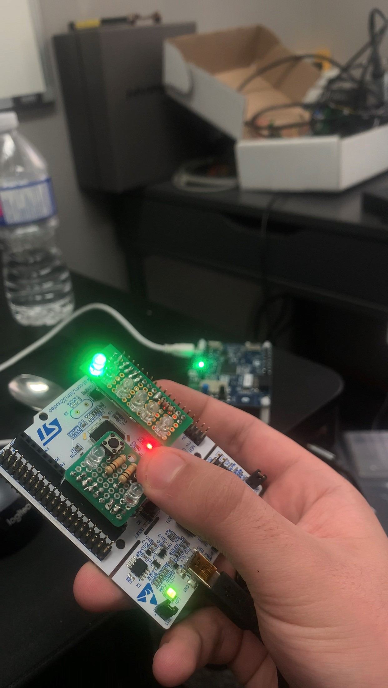

<!-- Improved compatibility of back to top link: See: https://github.com/othneildrew/Best-README-Template/pull/73 -->

[![Contributors][contributors-shield]][contributors-url]
[![Forks][forks-shield]][forks-url]
[![Stargazers][stars-shield]][stars-url]
[![Issues][issues-shield]][issues-url]
[![MIT License][license-shield]][license-url]
[![LinkedIn][linkedin-shield]][linkedin-url]

<!-- PROJECT LOGO -->
 

  

<h3 align="center">Morse Code Decoder</h3>

  

    STM32 based system using FreeRTOS to input a message using morse code, an LED to simultaneously flash while inputting as an indicator to the sender, the letters/numbers being printed in realtime, and the final output message blinking an LED as an indicator to the reciever.
     
     
    <a href="https://github.com/DarmorGamz/Morse-Code-Decoder">View Demo</a>
    ·
    <a href="https://github.com/DarmorGamz/Morse-Code-Decoder/issues">Report Bug</a>
    ·
    <a href="https://github.com/DarmorGamz/Morse-Code-Decoder/issues">Request Feature</a>
  

<!-- TABLE OF CONTENTS -->

  
Table of Contents

  <ol>
    <li>
      <a href="#about-the-project">About The Project</a>
      <ul>
        <li><a href="#built-with">Built With</a></li>
      </ul>
    </li>
    <li>
      <a href="#getting-started">Getting Started</a>
      <ul>
        <li><a href="#prerequisites">Prerequisites</a></li>
        <li><a href="#installation">Installation</a></li>
      </ul>
    </li>
    <li><a href="#contributing">Contributing</a></li>
    <li><a href="#license">License</a></li>
    <li><a href="#contact">Contact</a></li>
    <li><a href="#acknowledgments">Acknowledgments</a></li>
  </ol>

<!-- ABOUT THE PROJECT -->
## About The Project

### Built With

* [![C][C.com]][C-url]

(<a href="#readme-top">back to top</a>)

<!-- GETTING STARTED -->
## Getting Started

This is an example of how you may give instructions on setting up your project locally.
To get a local copy up and running follow these simple example steps.

### Prerequisites

### Installation

(<a href="#readme-top">back to top</a>)

<!-- CONTRIBUTING -->
## Contributing

Contributions are what make the open source community such an amazing place to learn, inspire, and create. Any contributions you make are **greatly appreciated**.

If you have a suggestion that would make this better, please fork the repo and create a pull request. You can also simply open an issue with the tag "enhancement".
Don't forget to give the project a star! Thanks again!

1. Fork the Project
2. Create your Feature Branch (`git checkout -b feature/AmazingFeature`)
3. Commit your Changes (`git commit -m 'Add some AmazingFeature'`)
4. Push to the Branch (`git push origin feature/AmazingFeature`)
5. Open a Pull Request

(<a href="#readme-top">back to top</a>)

<!-- LICENSE -->
## License

Distributed under the GPL License. See `LICENSE.txt` for more information.

(<a href="#readme-top">back to top</a>)

<!-- CONTACT -->
## Contact

Darren Morrison - Darren09@live.ca

Project Link: [https://github.com/DarmorGamz/Morse-Code-Decoder](https://github.com/DarmorGamz/Morse-Code-Decoder)

(<a href="#readme-top">back to top</a>)

<!-- ACKNOWLEDGMENTS -->
## Acknowledgments

(<a href="#readme-top">back to top</a>)

<!-- MARKDOWN LINKS & IMAGES -->
<!-- https://www.markdownguide.org/basic-syntax/#reference-style-links -->
[contributors-shield]: https://img.shields.io/github/contributors/DarmorGamz/Morse-Code-Decoder.svg?style=for-the-badge
[contributors-url]: https://github.com/DarmorGamz/Morse-Code-Decoder/graphs/contributors
[forks-shield]: https://img.shields.io/github/forks/DarmorGamz/Morse-Code-Decoder.svg?style=for-the-badge
[forks-url]: https://github.com/DarmorGamz/Morse-Code-Decoder/network/members
[stars-shield]: https://img.shields.io/github/stars/DarmorGamz/Morse-Code-Decoder.svg?style=for-the-badge
[stars-url]: https://github.com/DarmorGamz/Morse-Code-Decoder/stargazers
[issues-shield]: https://img.shields.io/github/issues/DarmorGamz/Morse-Code-Decoder.svg?style=for-the-badge
[issues-url]: https://github.com/DarmorGamz/Morse-Code-Decoder/issues
[license-shield]: https://img.shields.io/github/license/DarmorGamz/Morse-Code-Decoder.svg?style=for-the-badge
[license-url]: https://github.com/DarmorGamz/Morse-Code-Decoder/blob/master/LICENSE.txt
[linkedin-shield]: https://img.shields.io/badge/-LinkedIn-black.svg?style=for-the-badge&logo=linkedin&colorB=555
[linkedin-url]: https://linkedin.com/in/darren--morrison
[product-screenshot]: images/screenshot.png 

[C.com]: https://img.shields.io/badge/c-%2300599C.svg?style=for-the-badge&logo=c&logoColor=white
[C-url]: https://www.cprogramming.com
